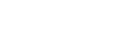

# Prototype game elements

## Dual grid system

- Based on [Oskar Stålberg's talk](https://www.youtube.com/watch?v=Uxeo9c-PX-w&t=308s) and [this video by jess::codes](https://www.youtube.com/watch?v=jEWFSv3ivTg)
- Allows to generate any grid outline from one simple texture

(area outline texture)

## Adaptive path

- Allows to generate any grid path from simple texture
- Distinct origin and target segment

(grid path texture)

## Snapping cursor

- Allows to tweak snapping parameters

# Used assets

- [Tiny RPG Character Asset Pack v1.03 by Zerie](https://zerie.itch.io/tiny-rpg-character-asset-pack)
- [Pixel Art Top Down - Basic by Cainos](https://cainos.itch.io/pixel-art-top-down-basic)
- [Retro Pixel Font](https://retro-pixel-font.takwolf.com)
